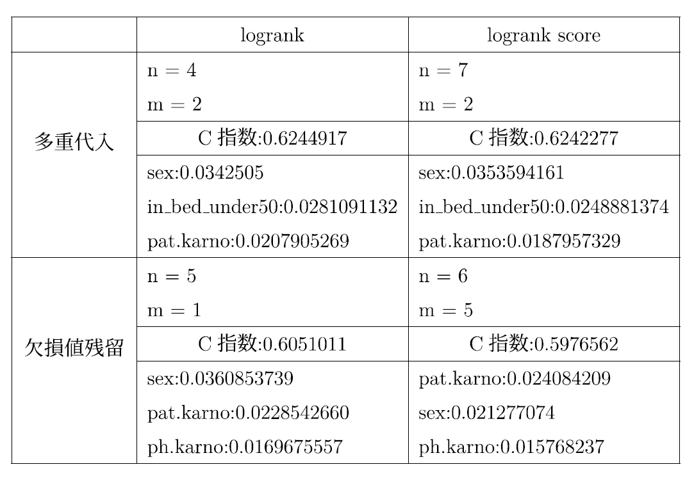

# CoxPH and Random Survival Forest (RSF) — Senior Thesis

## Overview
This repository summarizes my undergraduate thesis on survival prediction using a lung cancer dataset.
I compare a classical statistical model (Cox Proportional Hazards; CoxPH) and a machine-learning model
(Random Survival Forest; RSF), focusing on predictive performance (C-index) and interpretability.

## What this study aims to demonstrate
In this study, I aim to demonstrate that:
- Survival prediction performance and interpretability can differ meaningfully between CoxPH and RSF.
- Practical modeling choices—such as **variable selection**, **missing-data handling**, and **RSF split rules**
  (logrank vs. logrank score)—can change both the **C-index** and the set of influential variables.
- “Reducing information gaps” (e.g., missingness and feature selection ambiguity) is essential to build models
  that are usable for real-world decision-making.

## Approach

### Data & target
- **Task:** Predict time-to-event outcomes (survival analysis) for lung cancer patients.
- **Outcome representation:** survival time and event indicator (censoring vs. event).

### Features (examples)
The analysis uses clinical/demographic covariates such as:
- **sex**
- **Karnofsky performance scores** (e.g., physician- and patient-rated)
- **ECOG performance status** (and derived indicators, e.g., *completely_ambulatory*, *in_bed_under50*)
- **nutrition/weight-related variables** (e.g., meal calories, weight loss)
- (and other variables included in the dataset)

> Note: Variable names in the results tables match the dataset’s original naming (e.g., `pat.karno`, `ph.karno`).

### Models
- **Cox Proportional Hazards (CoxPH)**
  - Variable selection via stepwise procedures:
    - **Forward stepwise selection**
    - **Backward stepwise elimination**
- **Random Survival Forest (RSF)**
  - Survival forests with evaluation via **C-index**
  - Comparison of split rules:
    - **logrank**
    - **logrank score**
  - Missing-data settings compared:
    - **Multiple imputation**
    - **Leaving missing values** (and handling during training as implemented in the RSF workflow)

### Validation / evaluation
- Primary metric: **Harrell’s Concordance Index (C-index)**  
- (Where applicable) resampling / cross-validation used to compare configurations.

## Results

### 1) RSF: split rule (logrank vs. logrank score) and missing-data setting
The table below compares RSF configurations and shows the resulting **C-index** and key variable importance patterns.

### 2) CoxPH (Backward stepwise): selected variables and hazard ratios
This table reports coefficients, standard errors, hazard ratios (exp(beta)), confidence intervals, and p-values.

### 3) CoxPH (Forward stepwise): selected variables and hazard ratios
This table reports the forward stepwise CoxPH results.

## Future work
- **External validation:** Evaluate generalization on independent cohorts or different hospitals.
- **Richer evaluation:** Add time-dependent AUC, calibration, and subgroup analyses.
- **Model expansion:** Compare with additional survival ML methods (e.g., gradient boosting for survival, DeepSurv).
- **Interpretability:** Improve explanations (e.g., SHAP-like methods for survival models) and communicate results for non-experts.
- **Missing data:** Systematically study imputation strategies and sensitivity analyses to missingness mechanisms.

---
### Notes
- You can easily obtain datasets from an open R package.
